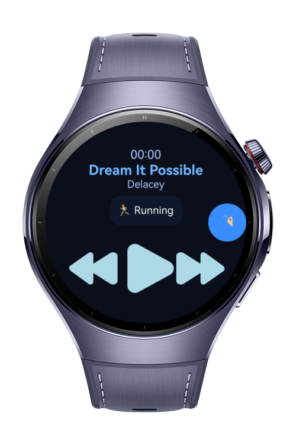
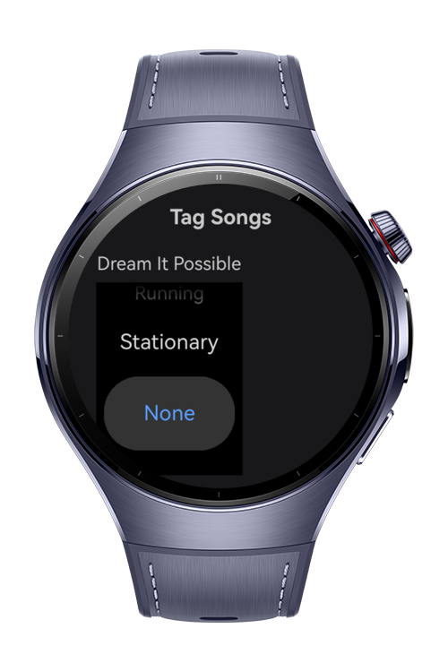

> **Note:** To access all shared projects, get information about environment setup, and view other guides, please visit [Explore-In-HMOS-Wearable Index](https://github.com/Explore-In-HMOS-Wearable/hmos-index).

# Move Beat

Move Beat is an intelligent wearable music player built with ArkTS and ArkUI, optimized for HarmonyOS smartwatches.  
It automatically changes your playlist based on your physical activity — walking, running, or stationary — and keeps playback smooth and intuitive with full crown control and background audio support.


## Preview
<div>


</div>

## Use Cases

### Activity-Aware Music
- Automatically switches playlists according to detected activity (Walking / Running / Stationary).
- Tag songs manually by activity type through the Tag Songs screen.

### Seamless Playback
- Play, pause, and skip songs directly from your watch.  
- Background playback keeps music running even when you switch apps.

### Smart Background Resume
- Restores playback progress and state seamlessly when reopening the app.  
- Keeps AV session active for lock-screen controls.


## Tech Stack

**Languages:**  
- ArkTS (Ark TypeScript)

**Frameworks:**  
- HarmonyOS SDK 5.1.0 (API Version 18)

**Tools:**  
- DevEco Studio Version 5.1.0.842

**Core Libraries & Kits:**  
- @kit.MediaKit – handles playback (play, pause, seek, skip)  
- @kit.AudioKit – controls audio streams  
- @kit.BackgroundTasksKit – ensures background music persistence  
- @kit.PerformanceAnalysisKit – logs & diagnostics  
- Crown Event APIs – hardware crown integration for rotation-based control  
- @kit.AbilityKit – UI Ability & lifecycle management

---

## Project Directory

```
|--- audio
|    |--- AVSessionController.ets    # Manages AV session & lock-screen control
|    |--- BackgroundUtil.ets         # Handles background running tasks
|    |--- MediaController.ets        # Core playback logic (play/pause/next/prev)
|    |--- MediaTools.ets             # Utility helpers for media and resources

|--- common
|    |--- constants
|    |    |--- MusicData.ets         # Mock or local song data
|    |--- model
|    |    |--- MusicModel.ets        # Defines song structure & tags

|--- services
|    |--- ActivityDetector.ets       # Detects physical activity (mock or sensor)
|    |--- ActivityMusicManager.ets   # Switches songs based on detected activity

|--- pages
|    |--- Index.ets                  # Entry screen & floating Tag button
|    |--- PlaybackPage.ets           # Central playback UI (activity chip)
|    |--- TagSongsPage.ets           # UI for tagging songs by activity

|--- viewmodel
|    |--- MainViewModel.ets          # Provides music data to the view
```


## Constraints and Restrictions

**Supported Devices:**  
- Huawei Watch 5 and newer  
- Devices running HarmonyOS 5.1.0 (API 18) or above  

**Constraints:**  
- Optimized for circular displays (466×466 px)  
- Touch and Crown rotation both supported  
- Requires background-audio permission  


## License

Move Beat is distributed under the terms of the MIT License.  
See the [LICENSE](/LICENSE) for more information.